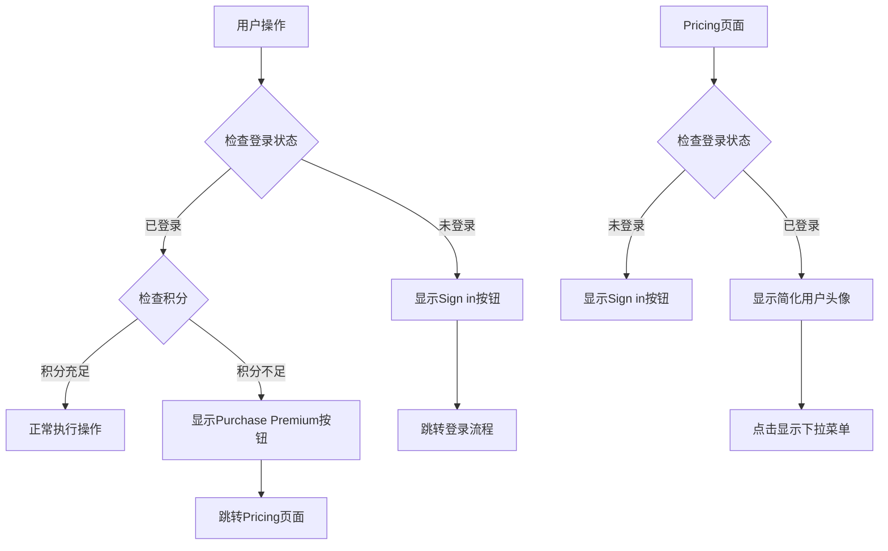
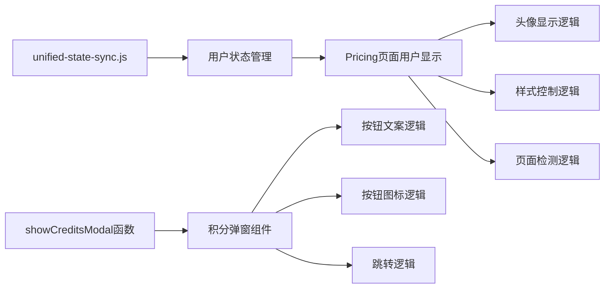

# UI/UX改进设计文档

## 概述

本设计文档详细说明如何实现积分不足弹窗按钮优化和Pricing页面用户显示简化的技术方案。设计遵循最小化修改原则，确保在改进用户体验的同时保持系统稳定性。

## 架构

### 系统架构图



### 组件关系图



## 组件和接口

### 1. 积分弹窗组件改进

#### 当前实现分析
- 位置：`public/index.html` 第131-200行
- 函数：`showCreditsModal(currentCredits, requiredCredits)`
- 当前逻辑：根据`currentCredits`值决定显示内容

#### 设计改进

**按钮文案和图标逻辑**
```javascript
// 当前实现（需要修改）
if (currentCredits === 0) {
    primaryBtnSpan.textContent = 'Purchase premium';
    // 需要添加图标修改逻辑
}

// 改进后的实现
if (currentCredits === 0) {
    // 修改按钮图标为皇冠
    const iconElement = primaryBtn.querySelector('.google-icon') || 
                       primaryBtn.querySelector('i');
    if (iconElement) {
        iconElement.className = 'fas fa-crown';
    }
    primaryBtnSpan.textContent = 'Purchase Premium';
}
```

**HTML结构修改**
```html
<!-- 当前结构 -->
<button class="credits-modal-btn primary">
    <div class="google-icon"></div>
    <span>Purchase premium</span>
</button>

<!-- 改进后结构 -->
<button class="credits-modal-btn primary">
    <i class="fas fa-crown"></i>
    <span>Purchase Premium</span>
</button>
```

### 2. Pricing页面用户显示组件

#### 当前实现分析
- 位置：`public/js/modules/unified-state-sync.js` 第420-460行
- 功能：统一管理用户登录状态显示
- 当前问题：所有页面使用相同的显示逻辑

#### 设计改进

**页面检测逻辑**
```javascript
// 添加页面检测
const isPricingPage = window.location.pathname.includes('pricing.html') ||
                     window.location.pathname.endsWith('pricing');

// 根据页面应用不同样式
if (this.currentUser) {
    const userDisplayHTML = isPricingPage ? 
        this.generateSimplifiedUserDisplay() : 
        this.generateStandardUserDisplay();
}
```

**简化用户显示方法**
```javascript
generateSimplifiedUserDisplay() {
    return `
        <div class="user-avatar simplified">
            
        </div>
    `;
}

generateStandardUserDisplay() {
    return `
        <div class="user-avatar">
            
            <span class="user-name">${this.currentUser.name || this.currentUser.email}</span>
        </div>
    `;
}
```

**CSS样式控制**
```css
/* Pricing页面特殊样式 */
.user-avatar.simplified {
    border: none !important;
    background: none !important;
    padding: 4px !important;
}

.user-avatar.simplified img {
    border: none !important;
}
```

## 数据模型

### 用户状态数据结构
```javascript
{
    currentUser: {
        uuid: "string",
        email: "string", 
        name: "string",
        avatar_url: "string",
        credits: "number"
    },
    isLoggedIn: "boolean",
    currentPage: "string" // 用于页面检测
}
```

### 弹窗状态数据结构
```javascript
{
    modalType: "not_logged_in" | "zero_credits" | "insufficient_credits",
    currentCredits: "number | null",
    requiredCredits: "number",
    buttonConfig: {
        text: "string",
        icon: "string", 
        action: "function"
    }
}
```

## 错误处理

### 1. 积分弹窗错误处理

**DOM元素缺失处理**
```javascript
function showCreditsModal(currentCredits = null, requiredCredits = 10) {
    const modal = document.getElementById('creditsModal');
    const title = document.getElementById('creditsModalTitle');
    const content = document.getElementById('creditsModalContent');

    if (!modal || !title || !content) {
        console.error('❌ Modal elements not found');
        // 降级处理：直接跳转到pricing页面
        if (currentCredits !== null) {
            window.location.href = 'pricing.html';
        }
        return;
    }
    
    // 继续正常逻辑...
}
```

**按钮元素处理**
```javascript
const primaryBtn = modal.querySelector('.credits-modal-btn.primary');
const primaryBtnSpan = primaryBtn?.querySelector('span');
const iconElement = primaryBtn?.querySelector('i, .google-icon');

if (!primaryBtn || !primaryBtnSpan) {
    console.warn('⚠️ Button elements not found, using fallback');
    // 创建备用按钮
    createFallbackButton(modal, currentCredits);
    return;
}
```

### 2. Pricing页面用户显示错误处理

**页面检测失败处理**
```javascript
detectCurrentPage() {
    try {
        const pathname = window.location.pathname;
        const isPricingPage = pathname.includes('pricing.html') || 
                             pathname.endsWith('pricing') ||
                             pathname.includes('pricing');
        return isPricingPage ? 'pricing' : 'other';
    } catch (error) {
        console.warn('⚠️ Page detection failed, using default display');
        return 'other';
    }
}
```

**用户头像加载失败处理**
```javascript
generateUserAvatarHTML(simplified = false) {
    const avatarUrl = this.currentUser?.avatar_url || 'https://via.placeholder.com/32';
    const fallbackUrl = 'https://via.placeholder.com/32?text=U';
    
    return `
        <div class="user-avatar ${simplified ? 'simplified' : ''}">
            
            ${!simplified ? `<span class="user-name">${this.currentUser?.name || this.currentUser?.email || 'User'}</span>` : ''}
        </div>
    `;
}
```

## 测试策略

### 1. 单元测试

**积分弹窗测试用例**
```javascript
describe('Credits Modal', () => {
    test('未登录用户显示Sign in按钮', () => {
        showCreditsModal(null);
        expect(getButtonText()).toBe('Sign in');
        expect(getButtonIcon()).toBe('google-icon');
    });
    
    test('积分为0显示Purchase Premium按钮', () => {
        showCreditsModal(0);
        expect(getButtonText()).toBe('Purchase Premium');
        expect(getButtonIcon()).toBe('fas fa-crown');
    });
    
    test('积分不足显示Purchase Premium按钮', () => {
        showCreditsModal(5, 10);
        expect(getButtonText()).toBe('Purchase Premium');
        expect(getButtonIcon()).toBe('fas fa-crown');
    });
});
```

**Pricing页面用户显示测试用例**
```javascript
describe('Pricing Page User Display', () => {
    test('Pricing页面显示简化头像', () => {
        mockCurrentPage('pricing.html');
        const display = generateUserDisplay();
        expect(display).toContain('simplified');
        expect(display).not.toContain('user-name');
    });
    
    test('其他页面显示标准头像', () => {
        mockCurrentPage('index.html');
        const display = generateUserDisplay();
        expect(display).not.toContain('simplified');
        expect(display).toContain('user-name');
    });
});
```

### 2. 集成测试

**用户流程测试**
1. 未登录用户触发积分弹窗 → 显示Sign in → 登录成功
2. 已登录用户积分不足 → 显示Purchase Premium → 跳转Pricing页面
3. Pricing页面登录状态 → 显示简化头像 → 点击显示菜单

**跨页面状态测试**
1. 首页登录 → 切换到Pricing页面 → 状态保持一致
2. Pricing页面操作 → 返回首页 → 状态同步正确

### 3. 用户体验测试

**视觉回归测试**
- 截图对比：改进前后的弹窗外观
- 响应式测试：不同屏幕尺寸下的显示效果
- 浏览器兼容性：主流浏览器的一致性

**可用性测试**
- 按钮点击响应时间
- 页面跳转流畅度
- 用户操作直观性

## 实施计划

### 阶段1：积分弹窗改进（预计0.5天）

1. **修改showCreditsModal函数**
   - 更新按钮文案逻辑
   - 添加图标切换逻辑
   - 保持跳转功能不变

2. **更新HTML结构**
   - 修改静态弹窗HTML中的按钮结构
   - 确保图标类名正确

3. **测试验证**
   - 测试不同积分状态下的弹窗显示
   - 验证按钮点击功能

### 阶段2：Pricing页面用户显示改进（预计0.5天）

1. **修改unified-state-sync.js**
   - 添加页面检测逻辑
   - 实现简化用户显示方法
   - 应用特殊样式

2. **CSS样式调整**
   - 添加简化样式类
   - 确保样式优先级正确

3. **测试验证**
   - 测试Pricing页面用户显示
   - 验证其他页面不受影响

### 阶段3：全面测试和优化（预计0.5天）

1. **功能测试**
   - 完整用户流程测试
   - 跨页面状态同步测试

2. **性能优化**
   - 检查是否有性能影响
   - 优化代码执行效率

3. **文档更新**
   - 更新相关技术文档
   - 记录变更日志

## 风险评估和缓解策略

### 高风险项

1. **DOM操作失败**
   - 风险：弹窗元素不存在导致错误
   - 缓解：添加完整的错误处理和降级方案

2. **样式冲突**
   - 风险：新样式与现有样式冲突
   - 缓解：使用特定的类名和!important声明

3. **功能回退**
   - 风险：修改导致原有功能失效
   - 缓解：保持原有逻辑结构，只修改显示部分

### 中风险项

1. **页面检测不准确**
   - 风险：无法正确识别Pricing页面
   - 缓解：使用多种检测方法，提供降级方案

2. **用户体验不一致**
   - 风险：不同页面的用户体验差异过大
   - 缓解：保持核心功能一致，只调整视觉表现

### 低风险项

1. **图标加载失败**
   - 风险：Font Awesome图标无法加载
   - 缓解：提供文字备选方案

2. **浏览器兼容性**
   - 风险：某些浏览器不支持新特性
   - 缓解：使用成熟的Web标准，避免实验性特性

## 性能考虑

### 1. 代码执行效率

**DOM查询优化**
```javascript
// 缓存DOM元素引用
class CreditsModalManager {
    constructor() {
        this.modal = document.getElementById('creditsModal');
        this.title = document.getElementById('creditsModalTitle');
        this.content = document.getElementById('creditsModalContent');
        this.primaryBtn = this.modal?.querySelector('.credits-modal-btn.primary');
    }
}
```

**页面检测缓存**
```javascript
class PageDetector {
    constructor() {
        this.currentPage = this.detectPage();
    }
    
    detectPage() {
        // 只在初始化时检测一次
        return window.location.pathname.includes('pricing.html') ? 'pricing' : 'other';
    }
}
```

### 2. 内存使用优化

- 避免创建不必要的DOM元素
- 及时清理事件监听器
- 使用对象池复用常用对象

### 3. 渲染性能

- 最小化DOM操作次数
- 使用CSS transform而非改变布局属性
- 避免强制同步布局

## 监控和维护

### 1. 错误监控

```javascript
// 添加错误上报
function reportError(error, context) {
    console.error(`UI/UX Error in ${context}:`, error);
    // 可以集成到错误监控服务
}
```

### 2. 用户行为监控

```javascript
// 监控按钮点击事件
function trackButtonClick(buttonType, action) {
    console.log(`Button clicked: ${buttonType} -> ${action}`);
    // 可以集成到分析服务
}
```

### 3. 性能监控

```javascript
// 监控关键操作耗时
function measurePerformance(operation, fn) {
    const start = performance.now();
    const result = fn();
    const end = performance.now();
    console.log(`${operation} took ${end - start} milliseconds`);
    return result;
}
```

## 总结

本设计文档提供了完整的UI/UX改进实施方案，包括：

1. **技术架构**：清晰的组件关系和数据流
2. **实现细节**：具体的代码修改方案
3. **错误处理**：完善的异常处理机制
4. **测试策略**：全面的测试覆盖计划
5. **风险控制**：详细的风险评估和缓解措施

设计遵循最小化修改原则，确保在改进用户体验的同时保持系统稳定性和可维护性。